  

<!-- টাইপিং অ্যানিমেশন (ছোট ও প্রফেশনাল) -->

  

<!-- আপনার পরিচয় (৩ লাইনে ভাগ করে দেওয়া হলো, যা আগে ১ লাইনে ছিল) -->

  💼 <strong>IT Administrator & Web Developer</strong> at Origin Agro &nbsp;|&nbsp;
  🛡️ <strong>Cybersecurity Enthusiast</strong> &nbsp;|&nbsp;
  🎓 B.E. CSE (Cyber Security) @ Chandigarh University

<!-- ভিজিটর ও সোশ্যাল ব্যাজ (এক্সট্রা সোশ্যাল লিংক যোগ করে দিলাম) -->

  
  
  

## 👨‍💻 About Me

- 🔭 I’m currently working on **[Origin Agro](https://origin-agro.vercel.app/)**  
- 📫 How to reach me: **rudra385353@gmail.com**  
- 🌐 Connect with me on [Instagram](https://www.instagram.com/the__rudraa_/), [LinkedIn](https://www.linkedin.com/in/rudrajit-pramanik3379/), [Facebook](https://www.facebook.com/Rudrajitpramanik/)

---

## 🌐 Connect with Me

  
  
  
  

---

<h3 align="center">⚡ Tech Stack & Tools</h3>

  <!-- প্রোগ্রামিং ল্যাঙ্গুয়েজ -->
  
  
  
   

 <!-- ফ্রেমওয়ার্ক ও টুলস -->
  
  
   
  <!-- সাইবার সিকিউরিটি টুলস -->
  
  
   
  <!-- ডাটাবেস ও ক্লাউড -->
  
  
  

---

## 🛠️ Languages & Tools

  <!-- Android -->
  
  <!-- Arduino -->
  
  <!-- AWS -->
  
  <!-- Blender -->
  
  <!-- C -->
  
  <!-- C++ -->
  
  <!-- CSS3 -->
  
  <!-- Docker -->
  
  <!-- Express -->
  
  <!-- Git -->
  
  <!-- HTML5 -->
  
  <!-- Illustrator -->
  
  <!-- Java -->
  
  <!-- MongoDB -->
  
  <!-- MySQL -->
  
  <!-- Node.js -->
  
  <!-- Postman -->
  
  <!-- Python -->
  
  <!-- React -->
  

### Additional Tools & Frameworks

  
  
  
  

---

<h3 align="center">📈 GitHub Analytics</h3>

<!-- 🔥 স্ট্রিক কার্ড (ঐচ্ছিক, কিন্তু ভালো দেখায়) -->

  

---

## 📊 GitHub Statistics

<!-- Contribution Graph (অপশনাল, কিন্তু ভালো দেখায়) -->

  

  
  

---

## 🎓 Certifications & Learning

### 🔐 Cybersecurity
- 🛡️ Cybersecurity Fundamentals
- 🔍 Ethical Hacking & Vulnerability Assessment
- 🌐 Network Security
- 🕵️ Digital Forensics

### 💻 Software Development
- ⚛️ React & Frontend Development
- 🌐 MERN Stack Development
- ☕ Java & Spring Boot
- 🐍 Python Development

### 🤖 Artificial Intelligence
- 🧠 AI/ML Fundamentals
- 🤖 Generative AI & LLM Applications
- 🔎 AI-powered Application Development

### 🗄️ Core Computer Science
- 🗃️ Database Management Systems
- ⚙️ Operating Systems
- 🧮 Data Structures & Algorithms
- 🌐 Computer Networks

---

## 👾 Pacman Contribution Graph

<picture>
  <source media="(prefers-color-scheme: dark)" srcset="https://raw.githubusercontent.com/rudrajit01/rudrajit01/output/pacman-contribution-graph-dark.svg">
  <source media="(prefers-color-scheme: light)" srcset="https://raw.githubusercontent.com/rudrajit01/rudrajit01/output/pacman-contribution-graph.svg">
  
</picture>

---

  <i>"Securing the digital world, one line of code at a time."</i> 🔒

---

  

<!-- Waving Banner at Bottom -->

  

